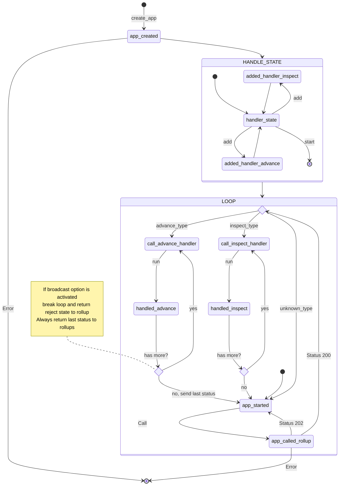

# deroll

Deroll, a TypeScript framework, facilitates the development of decentralized applications (dApps) on the  [Cartesi](https://cartesi.io) blockchain technology. With a focus on simplicity, Deroll offers a toolkit and conventions to streamline your development workflow. Easily onboard using Node.js, Sunodo, and Deroll to start building your Cartesi application with ease.

## Quick Start

### Prerequisites

Ensure you have Node.js and Yarn installed; you can download them from [nodejs.org](https://nodejs.org/) and [yarnpkg.com](https://yarnpkg.com/). Additionally, it's necessary to install [sunodo](https://docs.sunodo.io/guide/introduction/installing) as it is an essential component for running the dApp.

### Create a new project with the TypeScript template

```shell
sunodo create hello-world --template typescript
```

### Add deroll to your project

```shell
cd hello-world
yarn add @deroll/app
```

### Write a simple Cartesi application

Open the file `src/index.ts` and copy and paste the following code:

```ts
// Import necessary modules
import { createApp } from "@deroll/app";

// Create the application
const app = createApp({ url: process.env.ROLLUP_HTTP_SERVER_URL || "http://127.0.0.1:5004" });

// Handle input encoded in hex
app.addAdvanceHandler(async ({ payload }) => {
  const hexString = payload.replace(/^0x/, '');
  const buffer = Buffer.from(hexString, "hex");

  // Convert the buffer to a UTF-8 string
  const utf8String = buffer.toString("utf8");
  console.log(utf8String);
  return Promise.resolve("accept");
});

// Start the application
app.start().catch((e) => {
  console.error(e);
  process.exit(1);
});
```

### Build and run your dApp

```shell
sunodo build
sunodo run
```

Expected output:

```shell
prompt-1     | Anvil running at http://localhost:8545
prompt-1     | GraphQL running at http://localhost:8080/graphql
prompt-1     | Inspect running at http://localhost:8080/inspect/
prompt-1     | Explorer running at http://localhost:8080/explorer/
prompt-1     | Press Ctrl+C to stop the node
```

### Send a message

Open a new terminal and run:

```shell
sunodo send
```

Choose `Send generic input to the application.`
After choose `Foundry`
Select the defaults:
Select the RPC URL `http://127.0.0.1:8545`
Select Mnemonic
Account, DApp address
Select `Input String encoding` and in the input type `Hello world!` and hit enter.

Expected output:

```shell
sunodo send
? Select send sub-command Send generic input to the application.
? Chain Foundry
? RPC URL http://127.0.0.1:8545
? Wallet Mnemonic
? Mnemonic test test test test test test test test test test test junk
? Account 0xf39Fd6e51aad88F6F4ce6aB8827279cffFb92266 9999.969240390387558666 ETH
? DApp address 0x70ac08179605AF2D9e75782b8DEcDD3c22aA4D0C
? Input String encoding
? Input (as string) Hello world!
✔ Input sent: 0xebd90fe6fd50245dfa30f33e2d68236a73b25e2351106484cfa9d815e401939d
```

Expected output in the `sunodo run` terminal:

```shell
prompt-1     | Anvil running at http://localhost:8545
prompt-1     | GraphQL running at http://localhost:8080/graphql
prompt-1     | Inspect running at http://localhost:8080/inspect/
prompt-1     | Explorer running at http://localhost:8080/explorer/
prompt-1     | Press Ctrl+C to stop the node
validator-1  | [INFO  rollup_http_server::http_service] Received new request of type ADVANCE
validator-1  | [INFO  actix_web::middleware::logger] 127.0.0.1 "POST /finish HTTP/1.1" 200 224 "-" "undici" 0.000960
validator-1  | Hello world!
```

Now you're ready to start building your Cartesi application with sunodo and deroll!

## Build from source

### Requirements

-   Corepack (with pnpm) or pnpm v8 (8.7.1 recommended)
-   Node 20 or greater (LTS)

### Installation

Corepack is a package manager that allows you to install packages from different package managers.
It is recommended to use it to install deroll because it come with nodejs.
But you can use pnpm if you want. To install corepack follow the instructions [here](https://pnpm.io/installation).

```sh
corepack install
corepack pnpm install
```

### Build

```sh
npm run build
```

## How to work

This application has 3 packages:

1. App: responsible for creating the link with application and adding handlers.
1. Wallet: responsible for handle transactions in `advance` state with transactions and contracts from ETH.
1. Router: responsible for handle transactions in `inspect` state and create report if necessary.

In app package, there are three main parts:

1. **Creation** of the application using endpoint to Rollup, where the program will make the calls later.
1. The **addition of the handlers** that will be executed when the program receives the inputs, whether inspect or advance. Some another options are available. See more about later.
1. **Start the application**, where the program in a loop will receive the inputs, execute the handlers.

-   If input are from type  `inspect` the handler will not return anything, but if the input are from type `advance` the program will return `accept` or `reject`.
-   In cases where advance is  `reject`, always return at least one is accept, otherwise return `reject` to rollup.

### Another methods

In app packages have some options are available, see below:

#### createVoucher

Vouchers are a way to send information carried out on L1.
See more about [here](https://docs.cartesi.io/cartesi-rollups/main-concepts#vouchers)

Example:

```ts
// code here
```

#### createNotice

Notices are information statements.
See more about [here](https://docs.cartesi.io/cartesi-rollups/main-concepts#notices)

Example:

```ts
// code here
```

#### createReport

Reports are application logs and diagnostic information, like error or warning.
See more about [here](https://docs.cartesi.io/cartesi-rollups/main-concepts#reports)

Example:

```ts
// code here
```

## Overview about deroll



## How to contribute

TODO

## License

This code is licensed under the [MIT License](./LICENSE).
