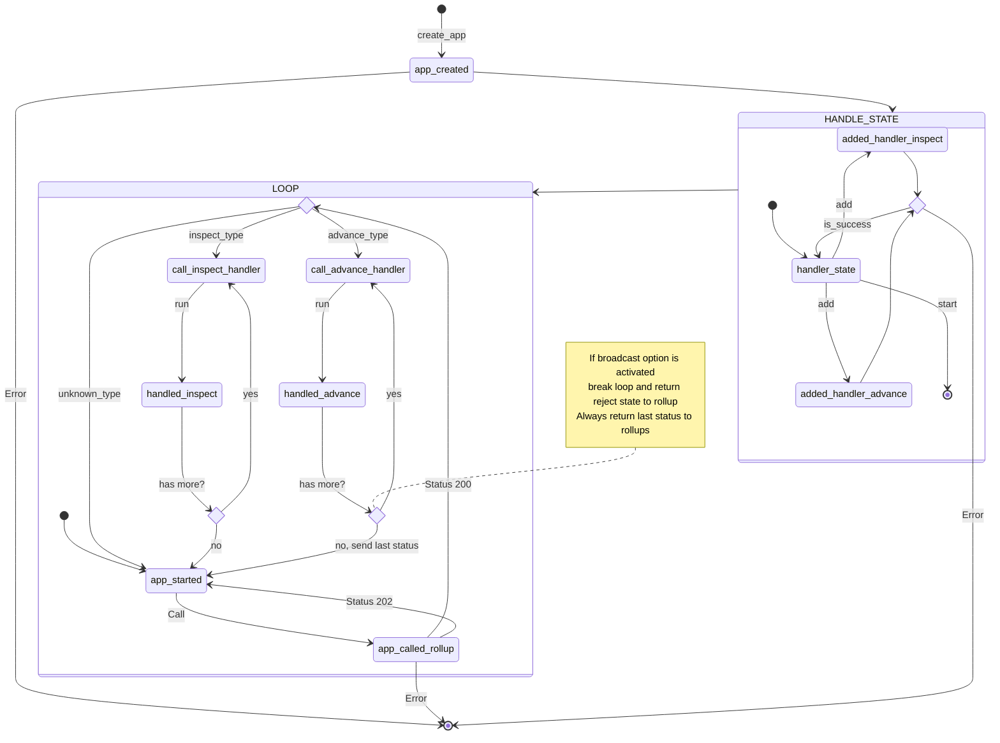

# deroll

Deroll is a TypeScript framework for developing [Cartesi](https://cartesi.io) applications.
The code below is a minimal application which just loops forever fetching inputs, but with no input handlers. In that case any input is `rejected`.

# Quick Start

## Prerequisites
Make sure you have Node.js and Yarn installed. You can download them from [nodejs.org](https://nodejs.org/) and [yarnpkg.com](https://yarnpkg.com/).

## Install sunodo

```shell
npm install -g @sunodo/cli
```

## Create a new project with the TypeScript template
```shell
sunodo create hello-world --template typescript
```

## Add deroll to your project
```shell
cd hello-world
yarn add @deroll/app
```

## Write a simple Cartesi application
Open the file `src/index.ts` and copy and paste the following code:

```ts
// Import necessary modules
import { createApp } from "@deroll/app";

// Create the application
const app = createApp({ url: process.env.ROLLUP_HTTP_SERVER_URL || "http://127.0.0.1:5004" });

// Handle input encoded in hex
app.addAdvanceHandler(async ({ payload }) => {
  const hexString = payload.replace(/^0x/, '');
  const buffer = Buffer.from(hexString, "hex");

  // Convert the buffer to a UTF-8 string
  const utf8String = buffer.toString("utf8");
  console.log(utf8String);
  return Promise.resolve("accept");
});

// Start the application
app.start().catch((e) => {
  console.error(e);
  process.exit(1);
});
```

## Build and run your dApp
```shell
sunodo build
```
Run
```shell
sunodo run
```
Expected output:
```shell
prompt-1     | Anvil running at http://localhost:8545
prompt-1     | GraphQL running at http://localhost:8080/graphql
prompt-1     | Inspect running at http://localhost:8080/inspect/
prompt-1     | Explorer running at http://localhost:8080/explorer/
prompt-1     | Press Ctrl+C to stop the node
```

## Send a message

Open a new terminal and run:
```shell
sunodo send
```
Choose `Send generic input to the application.`  
After choose `Foundry`  
Select the defaults:  
Select the RPC URL `http://127.0.0.1:8545`  
Select Mnemonic  
Account, DApp address  
Select `Input String encoding` and in the input type `Hello world!` and hit enter.

Expected output:
```shell
sunodo send
? Select send sub-command Send generic input to the application.
? Chain Foundry
? RPC URL http://127.0.0.1:8545
? Wallet Mnemonic
? Mnemonic test test test test test test test test test test test junk
? Account 0xf39Fd6e51aad88F6F4ce6aB8827279cffFb92266 9999.969240390387558666 ETH
? DApp address 0x70ac08179605AF2D9e75782b8DEcDD3c22aA4D0C
? Input String encoding
? Input (as string) Hello world!
✔ Input sent: 0xebd90fe6fd50245dfa30f33e2d68236a73b25e2351106484cfa9d815e401939d
```

Expected output in the `sunodo run` terminal:
```shell
prompt-1     | Anvil running at http://localhost:8545
prompt-1     | GraphQL running at http://localhost:8080/graphql
prompt-1     | Inspect running at http://localhost:8080/inspect/
prompt-1     | Explorer running at http://localhost:8080/explorer/
prompt-1     | Press Ctrl+C to stop the node
validator-1  | [INFO  rollup_http_server::http_service] Received new request of type ADVANCE
validator-1  | [INFO  actix_web::middleware::logger] 127.0.0.1 "POST /finish HTTP/1.1" 200 224 "-" "undici" 0.000960
validator-1  | Hello world!
```

Now you're ready to start building your Cartesi application with sunodo and deroll!

# How to contribute

# Requirements
- Corepack (with pnpm)


# Installation
```sh
corepack install
corepack pnpm install
```


# Example

```typescript
import { createApp } from "@deroll/app";

const app = createApp({ url: "http://127.0.0.1:5004" });
// TODO: add input handlers here
app.start().catch((e) => process.exit(1));
```

## How to work



## License

This code is licensed under the [MIT License](./LICENSE).
